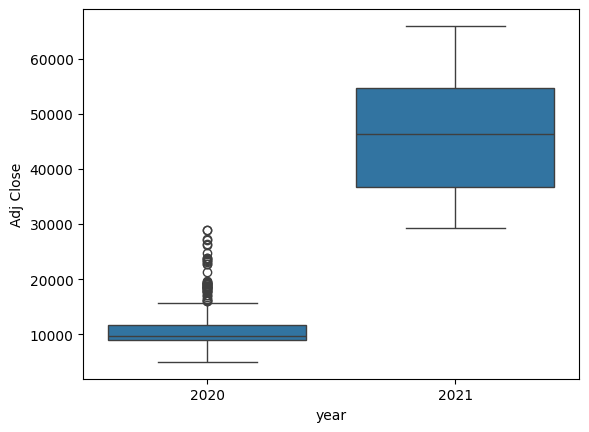
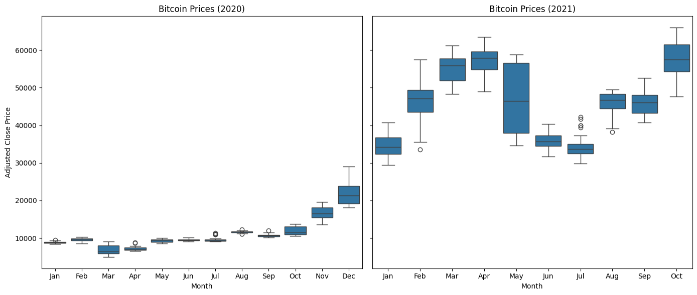
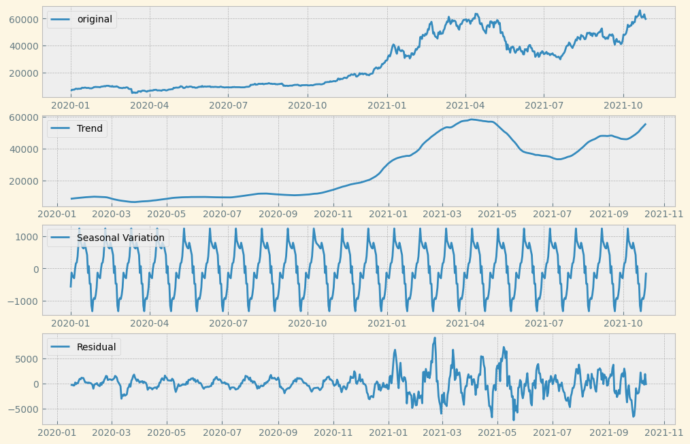
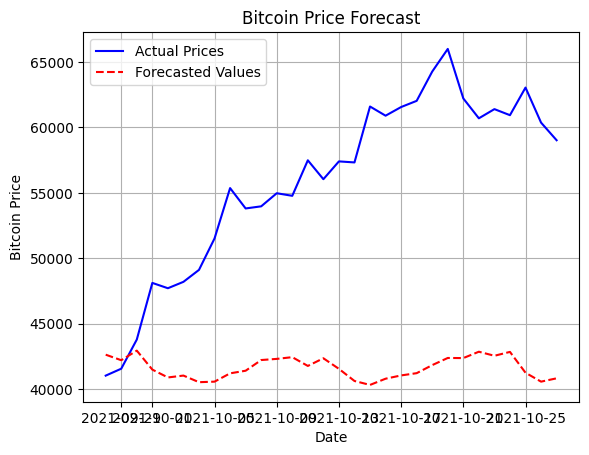
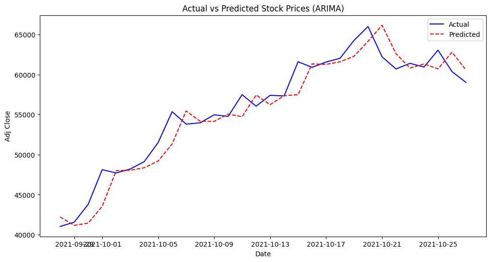
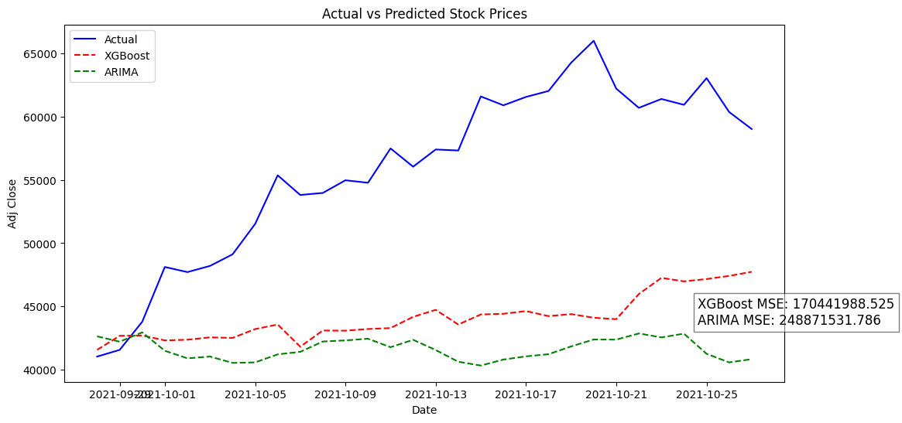

# Forecasting-BitCoin-Prices

## 1 Importing and Exploring the Data Set
### 1.1 Data Cleaning
For this project, I have used historical prices of Bitcoin available on Kaggle.
The link to the dataset is [here](https://www.kaggle.com/datasets/nisargchodavadiya/bitcoin-time-series-with-different-time-intervals). The first few columns of the dataset are shown below:

| Date | Open | High | Low | Close | Adj Close | Volume |
|------|------|------|-----|-------|-----------|--------|
| 2020-01-01 | 7194.89 | 7254.33 | 7174.94 | 7200.17 | 7200.17 | 1.85E+10 |
| 2020-01-02 | 7202.55 | 7212.15 | 6935.27 | 6985.47 | 6985.47 | 2.08E+10 |
| 2020-01-03 | 6984.42 | 7413.71 | 6914.99 | 7344.88 | 7344.88 | 2.81E+10 |
| 2020-01-04 | 7345.37 | 7427.38 | 7309.51 | 7410.65 | 7410.65 | 1.84E+10 |
| 2020-01-05 | 7410.45 | 7544.49 | 7400.53 | 7411.31 | 7411.31 | 1.97E+10 |

In our analysis, we will only be interested in the **"Adj Close"** column and build our model to predict the same.

Since we'll primarily be using the ARIMA function from the `pmdarima` library, which directly supports datetime indices, we set the **Date** column as the index and drop other columns that we won’t be using.
After doing so, our dataset looks like this:

| Date | Adj Close |
|------|-----------|
| 2020-01-01 | 7200.17 |
| 2020-01-02 | 6985.47 |
| 2020-01-03 | 7344.88 |
| 2020-01-04 | 7410.65 |
| 2020-01-05 | 7411.31 |


### 1.2 Data Preprocessing

To apply time series models, we must first check if our series is **stationary** or not. We use the **Dickey-Fuller Test** from the `statsmodels` library to test this.
The results of the test were:

```
Augmented Dickey-Fuller Test Results:
ADF Statistic: -0.317683
P-Value: 0.922962
Used Lags: 1
Number of Observations: 646
Critical Values:
   1%: -3.440513
   5%: -2.866024
   10%: -2.569158

Conclusion: The time series is non-stationary (fail to reject H0).
```

Since the series is **non-stationary**, we will apply **differencing** when using models like XGBoost, which assume stationarity.

## 2. Data Visualization

We perform basic exploratory visualizations to understand the dataset.

- First, we plot a **BoxPlot** of the "Adj Close" prices aggregated over **years**. The resulting boxplot is:

  

  This indicates that in **2020**, Bitcoin prices had relatively less fluctuation but experienced multiple outliers, suggesting the early stages of the upward trend seen in **2021**, where prices surged beyond **$10,000** to an average of **$45,000**.

- Next, we plot a **BoxPlot** of "Adj Close" aggregated over **months for each year**:

  

  These boxplots reveal that the Bitcoin rally started around **October 2020** and peaked around **April 2021**.

- Using the `seasonal_decompose` function in `statsmodels`, we decompose the time series into:
  1. **Long-Term Trend**
  2. **Seasonal Fluctuation**
  3. **Random Movements** (Residuals)
  
  

## 3. Fitting an ARIMA Model

The **ARIMA (AutoRegressive Integrated Moving Average)** model has three key parameters: **ARIMA(p, d, q)**.

- **p** → Number of past values (lags) used for prediction
- **d** → Number of differencing steps to make the series stationary
- **q** → Number of lagged forecast errors used

Instead of manually selecting these parameters, we use the `auto_arima` function from `pmdarima` to find the optimal values.

For our training dataset (up to September 2021), `auto_arima` selects the optimal parameters as:
Images/Trend_Decompose.png
```
(p, d, q) = (7, 1, 0)
```

We then train an **ARIMA(7,1,0)** model and plot the predictions for **October 2021** (test set):

  

This is our **baseline model**, against which we compare other models.

## 4. Fitting an ARIMA Model with Expanding Window

An **expanding window** approach is used, where each new test value is included in the training set before predicting the next value. This approach significantly improves the model’s accuracy.

  

However, this method **relies on actual test values** from the current period to predict the next period, which may not work well for **long-term forecasting**.

## 5. Fitting XGBoost

**XGBoost** is a powerful machine learning algorithm known for handling time series forecasting effectively. Here’s how we approach it:

1. Apply **differencing** to make the series stationary.
2. Use lag values as features for training.
3. Train an **XGBoost Regressor** and predict future values.

We then compare the **ARIMA baseline model**, **Expanding Window ARIMA**, and **XGBoost** predictions:

  

### **Findings:**
- **XGBoost performs slightly better** than the baseline ARIMA model.
- However, ARIMA is **better at capturing trends and movements**, while XGBoost has slightly better accuracy but underestimates price spikes.

---

This concludes our analysis of **Bitcoin Price Forecasting** using **ARIMA and XGBoost**! 🚀📈
